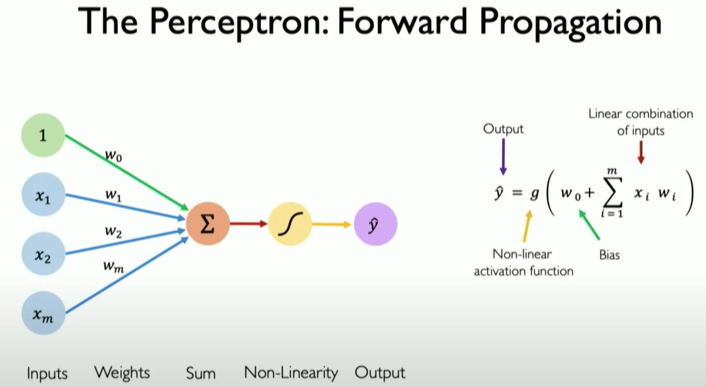

# 🧠 NE-Application Games

Welcome to the **Neural Evolution Algorithm** Games! This project demonstrates how we can evolve neural networks using genetic algorithms from scratch 🐣. These models are applied to an interactive game environment where a "bird" is learning how to navigate through obstacles (pipes) using its vision and decision-making capabilities!

## 🌟 What's Inside

This project uses a **Perceptron**-based neural network architecture to simulate a bird navigating through a series of pipes. The neural network evolves over time using **Neural Evolution** algorithms, allowing the bird to learn how to survive for longer periods by avoiding collisions.

## 🛠️ Key Components

### 1. **Neural Network Structure** 🧩

The core of the bird's decision-making process is based on a simple **Perceptron** model, which consists of input nodes, a hidden layer, and an output node that determines the bird's action.

- **Input Nodes**: These nodes take in the visual information from the bird's environment:
  - **Bird Vision**: Distance from the bird to the nearest top pipe.
  - **Top Pipe**: Distance to the top of the nearest pipe.
  - **Bottom Pipe**: Distance to the bottom of the nearest pipe.
  - **Middle of Top and Bottom Pipes**: The distance to the middle point between the top and bottom pipe openings.
  
  Each of these distances is a **floating-point value** that the neural network uses to compute an output.

- **Hidden Layer**: The hidden layer consists of neurons that process the information from the input nodes. Each hidden neuron applies a weighted sum of its inputs and passes it through an **activation function** (in this case, the **sigmoid** function).

- **Output Node**: The output node produces the final decision for the bird:
  - **1**: Flap the bird's wings (move upwards).
  - **0**: Do nothing (allow the bird to fall).

### 2. **Sigmoid Activation Function** 🧮

The **sigmoid** function is used as the activation function for each node in the neural network. It ensures that the output is smooth and falls within a range of (0, 1). The sigmoid function is given by the following equation:

\[
\text{sigmoid}(x) = \frac{1}{1 + e^{-x}}
\]

This function is crucial because it allows us to map any input (whether negative or positive) into a probability-like value. The bird’s decision to flap or not is based on whether the output of the sigmoid is closer to 1 or 0.

### 3. **Input Features** 🔍

The bird's brain is fed with the following **input features**:

- **Top Pipe (tp)**: The distance from the bird's current position to the top of the nearest pipe.
- **Bottom Pipe (bp)**: The distance from the bird's current position to the bottom of the nearest pipe.
- **Middle Point of the Pipes (mp)**: The middle point between the top and bottom pipe openings.

These inputs allow the bird to have a **complete understanding** of its surroundings and decide whether to flap its wings or not.

### 4. **Evolving the Network** 🧬

The most fascinating part of this project is the use of **Neural Evolution Algorithms**:

- **Mutation**: After each generation, small random changes are applied to the neural network's weights. This allows for the possibility of finding better solutions over time.
- **Crossover**: The top-performing neural networks (the best birds) are combined to produce offspring with mixed traits.
- **Selection**: Only the birds that perform best (survive the longest) are allowed to pass on their genes to the next generation.

## 🚀 How It Works

1. **Initial Population**: We start with a population of birds, each with a randomly initialized neural network.
2. **Training**: The birds are trained through trial and error. They receive feedback based on how long they survive in the game.
3. **Evolution**: The best-performing birds are selected, and their neural networks are used to produce the next generation through **mutation** and **crossover**.
4. **Learning Over Time**: With each generation, the birds learn to avoid obstacles more effectively by adjusting their neural network weights.

## 🦅 Bird Vision & Decision-Making

The bird’s decision-making revolves around its perception of the pipes in front of it. It uses three key distances:

- **Top Pipe** 🏞️: Distance from the bird to the top of the nearest pipe.
- **Bottom Pipe** 🏞️: Distance from the bird to the bottom of the nearest pipe.
- **Middle of Pipes** 🎯: The distance from the bird to the middle point between the top and bottom pipe openings.

By comparing these distances, the bird must decide whether to **flap** or **fall**, avoiding collision with pipes while navigating through gaps.

## 🎮 Play & Experiment

Feel free to experiment with the parameters of the neural network and the evolution process. Each generation can behave differently depending on the randomness of mutations and the environment configuration.

---

Thank you for exploring **NE-Application Games**! We hope you enjoy watching the bird evolve and learn to master the game 🐦💡.
